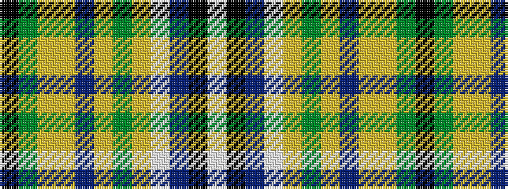

KGYYBYGYWBKW

It is a 12 stripe tartan.

<figure class="pat-woven">

<figcaption>idealised sample</figcaption>
</figure>

## Colour Sequence



## Tartans with this colour sequence

| Tartans |
|---------------|
| [State Seal of Idaho (Fashion)](/setts/s12/lb4k1b33lb4lo15g4lo3b4lo15lo2g30k2~x2/)|
||
