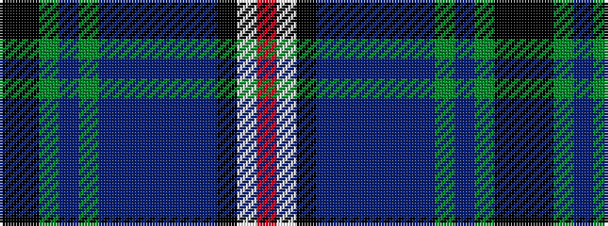

KKGBGBBBBBBKWR

It is a 14 stripe tartan.

<figure class="pat-woven">

<figcaption>idealised sample</figcaption>
</figure>

## Colour Sequence



## Tartans with this colour sequence

| Tartans |
|---------------|
| [Robert Lee Jordan Defiance (Personal)](/setts/s14/k3k1dg21dp1dg3dp12dt3dp3dt4dp3dt24k1w5r3~x2/)|
||
