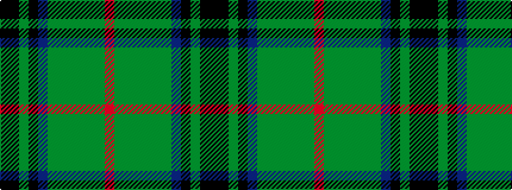

KKGKBGGGGGGR

It is a 12 stripe tartan.

<figure class="pat-woven">

<figcaption>idealised sample</figcaption>
</figure>

## Colour Sequence



## Tartans with this colour sequence

| Tartans |
|---------------|
| [McHeadley Society Corporate Tartan](/variants/s12/k2ki2dg10ki13db3g12dg2g2dg2g2dg18r2~x2/)|
||
