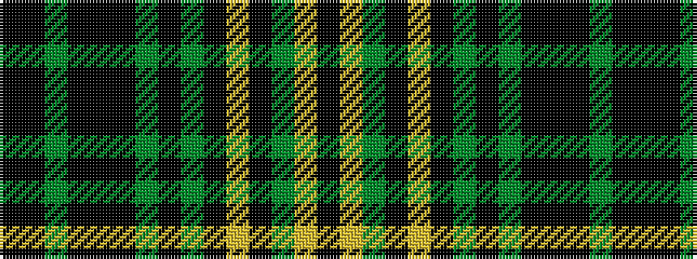

KKGKKKGKGKYKGYK

It is a 15 stripe tartan.

<figure class="pat-woven">

<figcaption>idealised sample</figcaption>
</figure>

## Colour Sequence



## Tartans with this colour sequence

| Tartans |
|---------------|
| [Eynon (Welsh Name)](/variants/s15/k11ki1g3k6ki1k6g3k4g7k11ly1k11g7ly2ki4~x2/)|
||
