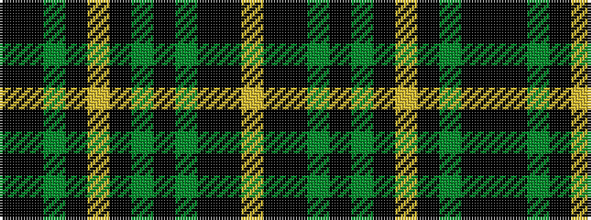

KKGKYKGKGKKY

It is a 12 stripe tartan.

<figure class="pat-woven">

<figcaption>idealised sample</figcaption>
</figure>

## Colour Sequence



## Tartans with this colour sequence

| Tartans |
|---------------|
| [Blue Castlefield (Fashion)](/setts/s12/lr3ki15k10dy10ki1g5ki1ly10ki10g8ki1k2~x2/)|
||
