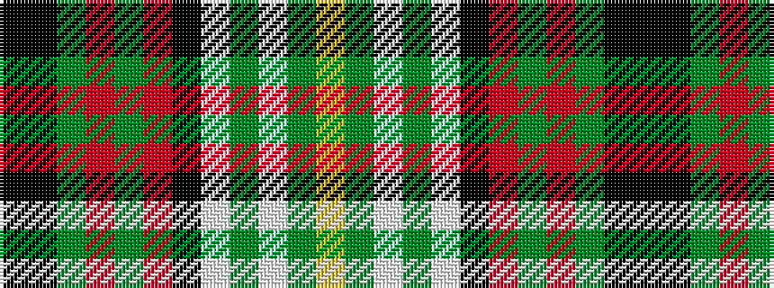

KKGRGRKWGWGY

It is a 12 stripe tartan.

<figure class="pat-woven">

<figcaption>idealised sample</figcaption>
</figure>

## Colour Sequence



## Tartans with this colour sequence

| Tartans |
|---------------|
| [Downs (Personal)](/setts/s12/k68k1g6r3g1r6k2w1g30lb1g2ly2~x2/)|
||
