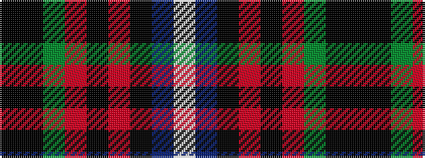

KKGRKRKBW

It is a 9 stripe tartan.

<figure class="pat-woven">

<figcaption>idealised sample</figcaption>
</figure>

## Colour Sequence



## Tartans with this colour sequence

| Tartans |
|---------------|
| [Dunedin (USA) (District)](/variants/s9/w3t25k3r3k3r8g21k3k2~x2/)|
||
