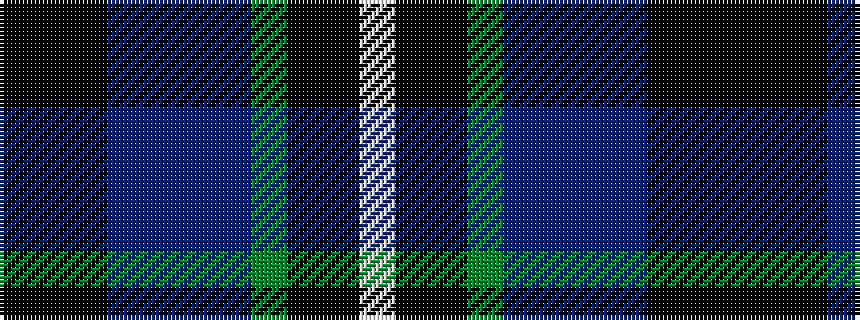

KKKBBBBGKKW

It is a 11 stripe tartan.

<figure class="pat-woven">

<figcaption>idealised sample</figcaption>
</figure>

## Colour Sequence



## Tartans with this colour sequence

| Tartans |
|---------------|
| [Highland Thistle](/variants/s11/ki38k4ki2dp6dpi11dp3dpi2dg2ki11k1w2~x2/)|
||
