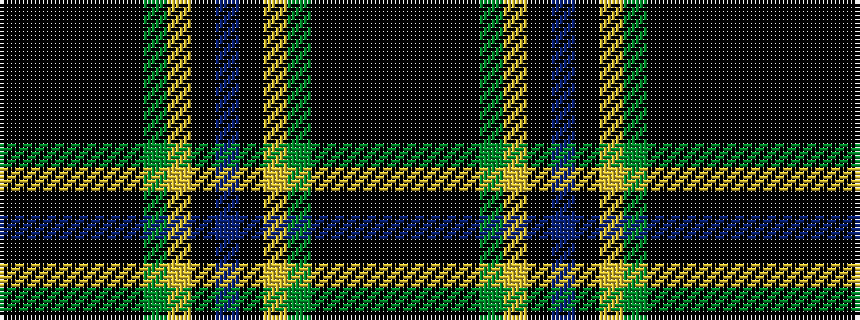

KKKKGYKBKYGKKKKKK

It is a 17 stripe tartan.

<figure class="pat-woven">

<figcaption>idealised sample</figcaption>
</figure>

## Colour Sequence



## Tartans with this colour sequence

| Tartans |
|---------------|
| [Polaris (Military)](/variants/s17/k6ki1k1ki1k1ki7g6lo1ki1db1ki1lo1g6ki7k7ki1k1~x4/)|
||
