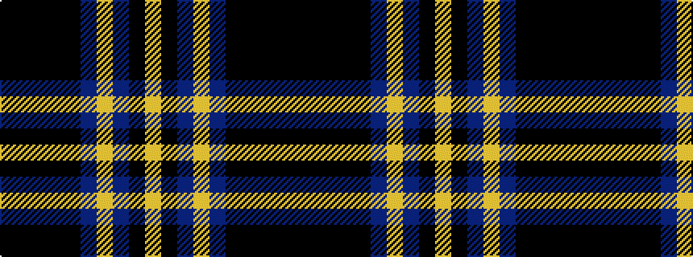

KKKKKBYBKY

It is a 10 stripe tartan.

<figure class="pat-woven">

<figcaption>idealised sample</figcaption>
</figure>

## Colour Sequence



## Tartans with this colour sequence

| Tartans |
|---------------|
| [Sonsub Corporate Tartan](/variants/s10/k30ki5k19ki5k2n20ly2n20ki5ly4~x2/)|
||
