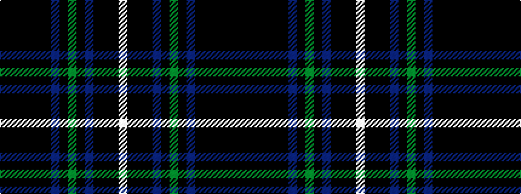

KKKKKKBKGKBKKKW

It is a 15 stripe tartan.

<figure class="pat-woven">

<figcaption>idealised sample</figcaption>
</figure>

## Colour Sequence



## Tartans with this colour sequence

| Tartans |
|---------------|
| [McCruden, Raymond (Personal)](/setts/s15/k15ki4k4ki4k4ki16db16ki2g3ki2db16ki16k18ki1w2~x2/)|
||
