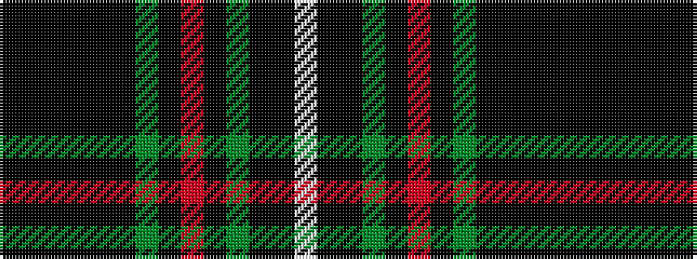

KKKKKKGKRKGKKW

It is a 14 stripe tartan.

<figure class="pat-woven">

<figcaption>idealised sample</figcaption>
</figure>

## Colour Sequence



## Tartans with this colour sequence

| Tartans |
|---------------|
| [Humphries (Personal)](/variants/s14/k16ki4k4ki4k6ki14dg17ki2r3ki2dg17ki14k18w4~x2/)|
||
