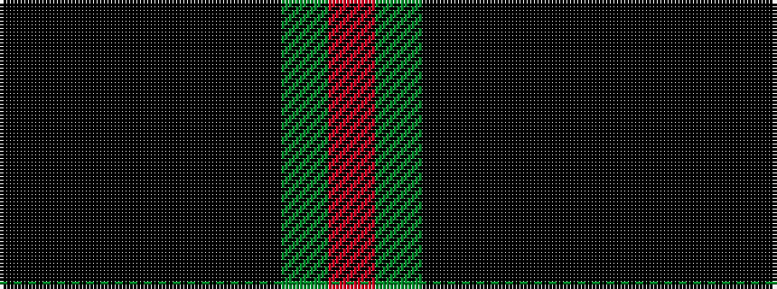

KKKKKKGR

It is a 8 stripe tartan.

<figure class="pat-woven">

<figcaption>idealised sample</figcaption>
</figure>

## Colour Sequence



## Tartans with this colour sequence

| Tartans |
|---------------|
| [The Caledonian Hotel](/variants/s8/k24k3k3k3k3k18dg20r4~x2/)|
||
