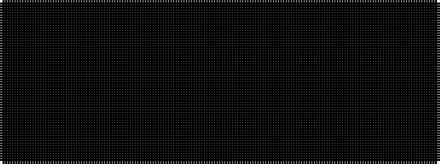

KKKKKKK

It is a 7 stripe tartan.

<figure class="pat-woven">

<figcaption>idealised sample</figcaption>
</figure>

## Colour Sequence



## Tartans with this colour sequence

| Tartans |
|---------------|
| [Black Spirit Fashion Tartan Tartan Number: 10119. Earliest known date: ACS Tartan See products available Copyright © Blair Urquhart, Comrie, 2015](/setts/s7/k17ki4k13ki4k3ki45k3~x2/)|
||
