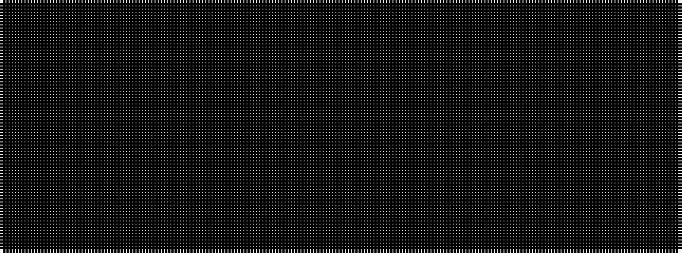

KKKKKKKKKK

It is a 10 stripe tartan.

<figure class="pat-woven">

<figcaption>idealised sample</figcaption>
</figure>

## Colour Sequence



## Tartans with this colour sequence

| Tartans |
|---------------|
| [City of Armadale Australian District Tartan](/variants/s10/ki21k2ki2k2ki3k15k29k2k2k4~x2/)|
||
| [Colin Wesley Webster](/variants/s10/ki100k5ki4k3ki2k1ki2k2ki4k5~x2/)|
||
