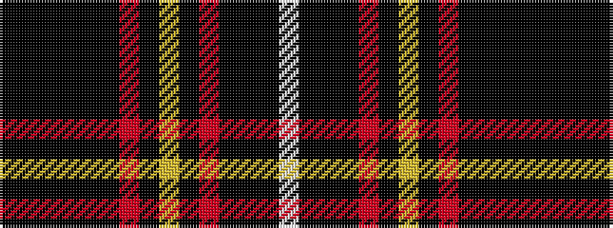

KKKKKKRKYKRKKKW

It is a 15 stripe tartan.

<figure class="pat-woven">

<figcaption>idealised sample</figcaption>
</figure>

## Colour Sequence



## Tartans with this colour sequence

| Tartans |
|---------------|
| [Bogle (2015)](/setts/s15/k16ki2k2ki2k2ki14r16ki1ly2ki1r16ki14k12ki1w2~x2/)|
||
