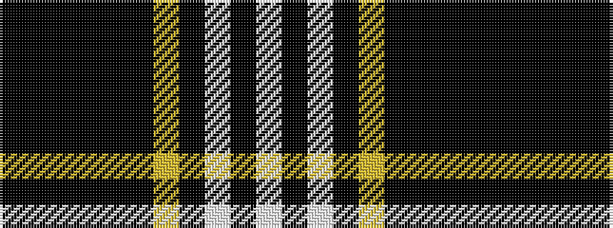

KKKKKKYKWKW

It is a 11 stripe tartan.

<figure class="pat-woven">

<figcaption>idealised sample</figcaption>
</figure>

## Colour Sequence



## Tartans with this colour sequence

| Tartans |
|---------------|
| [Kang Personal Tartan Tartan Number: 7425. Earliest known date: 2007 Designed by Catriona Duffy and David Kang See products available Copyright © Blair Urquhart, Comrie, 2015](/setts/s11/k44ki3k3ki3k3ki14ly4ki3w2ki2w2~x2/)|
||
