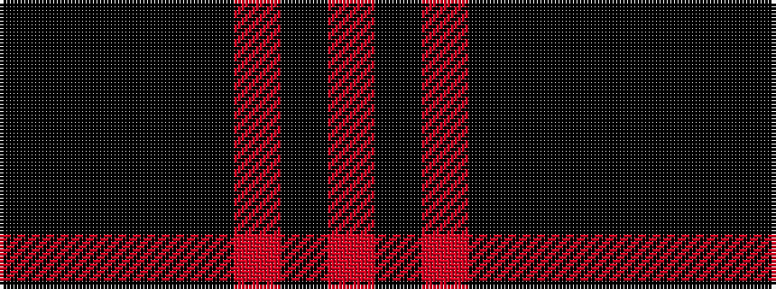

KKKKKRKR

It is a 8 stripe tartan.

<figure class="pat-woven">

<figcaption>idealised sample</figcaption>
</figure>

## Colour Sequence



## Tartans with this colour sequence

| Tartans |
|---------------|
| [Aitken (Fashion)](/setts/s8/k5k2ki2k12ki16r20ki2r4~x2/)|
||
