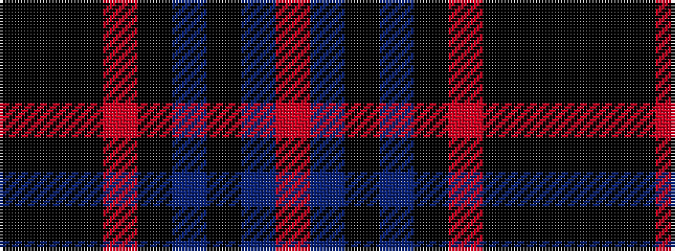

KKKRKBKBR

It is a 9 stripe tartan.

<figure class="pat-woven">

<figcaption>idealised sample</figcaption>
</figure>

## Colour Sequence



## Tartans with this colour sequence

| Tartans |
|---------------|
| [Wyse (2016)](/setts/s9/k8k3k8r2k20t6k8t6o2~x2/)|
||
