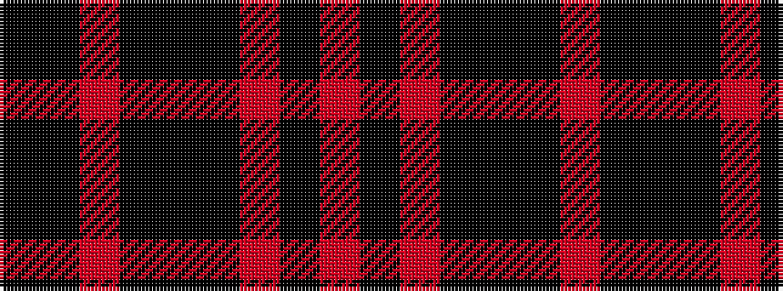

KKRKKKRKR

It is a 9 stripe tartan.

<figure class="pat-woven">

<figcaption>idealised sample</figcaption>
</figure>

## Colour Sequence



## Tartans with this colour sequence

| Tartans |
|---------------|
| [Arrol (Corporate)](/variants/s9/r2k4r4ki4ki1ki4r4ki4ki1~x4/)|
||
| [Dupplin (Estate Check)](/variants/s9/ki1k1r1k1ki1k1r1k1r1~x6/)|
||
