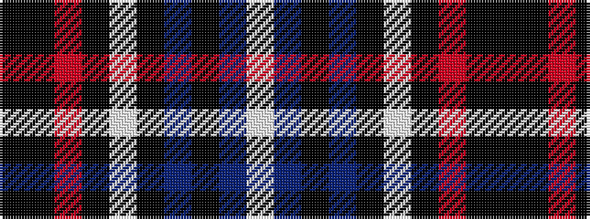

KKRKWKBKBW

It is a 10 stripe tartan.

<figure class="pat-woven">

<figcaption>idealised sample</figcaption>
</figure>

## Colour Sequence



## Tartans with this colour sequence

| Tartans |
|---------------|
| [Wcwm 1669-3](/setts/s10/k92k1r2k4lb2k8n8k2n16lb2~x2/)|
||
