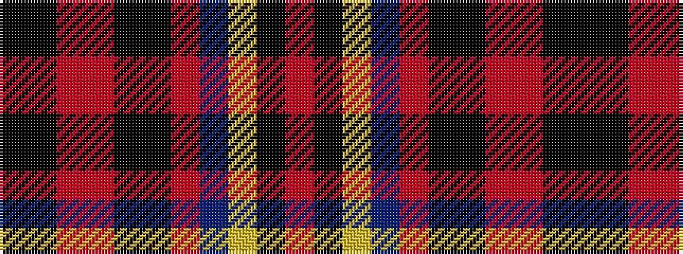

KKRRKKRBYKR

It is a 11 stripe tartan.

<figure class="pat-woven">

<figcaption>idealised sample</figcaption>
</figure>

## Colour Sequence



## Tartans with this colour sequence

| Tartans |
|---------------|
| [U.S. Air Force Reserve P. B. (Corpor](/setts/s11/r44k3lo20db3r8k29k5r3r2k5k10~x2/)|
||
