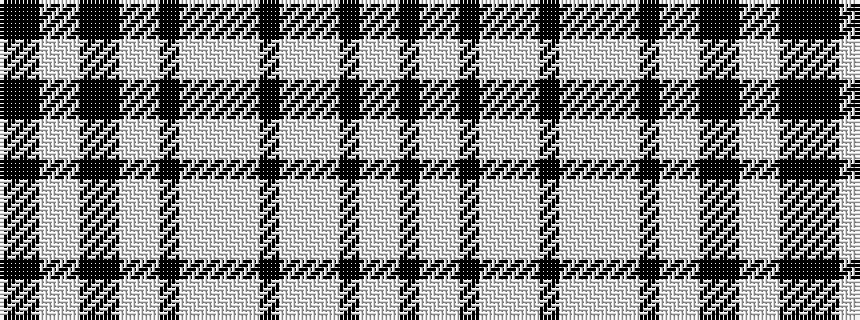

KKWWKKWWKWWWWKWWWKWWK

It is a 21 stripe tartan.

<figure class="pat-woven">

<figcaption>idealised sample</figcaption>
</figure>

## Colour Sequence



## Tartans with this colour sequence

| Tartans |
|---------------|
| [Abergaveny (Fashion)](/setts/s21/k36lb8lb33k4lb6lb8lb24k12lb4lb4lb6lb4k4lb48lb4k4k4lb6lb16k6k12/)|
||
