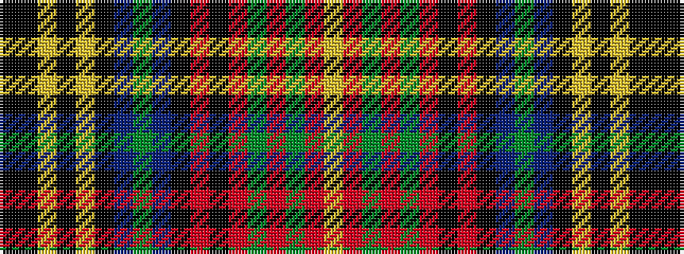

KKYKYKBGBKRKRGRGRY

It is a 18 stripe tartan.

<figure class="pat-woven">

<figcaption>idealised sample</figcaption>
</figure>

## Colour Sequence



## Tartans with this colour sequence

| Tartans |
|---------------|
| [Harmon Family Tartan Tartan Number: 7792. Earliest known date: 2006 The original design had no black stripe though the red. Mr Harmon designed the tartan because, as he said, there does not appear to be any Harmon tartan, nor do the Harmons in Scotland appear to have any historical clan affiliation. See products available Copyright © Blair Urquhart, Comrie, 2015](/setts/s18/ki2k6ly2k2ly2k19n2dg2n2k2r4ki2r11dg2r2dg2r6ly2~x2/)|
||
