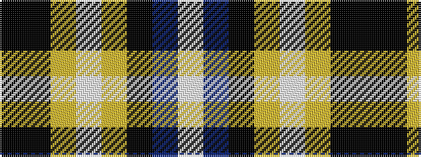

KKYWYKBW

It is a 8 stripe tartan.

<figure class="pat-woven">

<figcaption>idealised sample</figcaption>
</figure>

## Colour Sequence



## Tartans with this colour sequence

| Tartans |
|---------------|
| [Modern Craft (Masonic)](/setts/s8/k108k4lr4w2lr4k1db2w2~x2/)|
||
