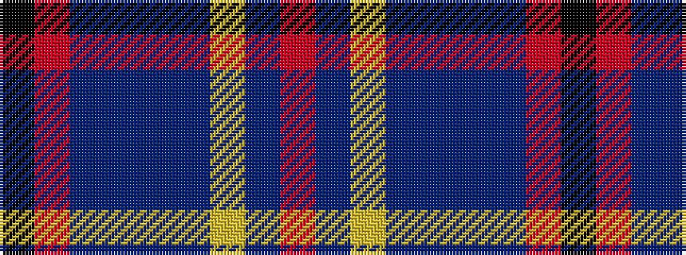

KRBBBBYBR

It is a 9 stripe tartan.

<figure class="pat-woven">

<figcaption>idealised sample</figcaption>
</figure>

## Colour Sequence



## Tartans with this colour sequence

| Tartans |
|---------------|
| [Junor (Personal)](/variants/s9/r72db6ly2db11t2db2t2r9k2~x2/)|
||
