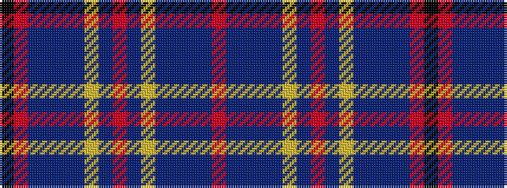

KRBBBBYBRBYBBBBR

It is a 16 stripe tartan.

<figure class="pat-woven">

<figcaption>idealised sample</figcaption>
</figure>

## Colour Sequence



## Tartans with this colour sequence

| Tartans |
|---------------|
| [Junor (Personal)](/variants/s16/r9t2db2t2db11ly2db6r72db6ly2db11t2db2t2r9k2~x2/)|
||
