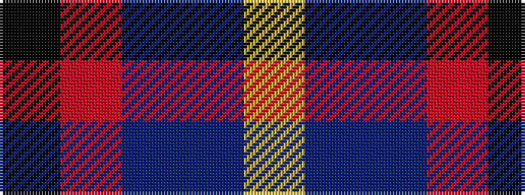

KRBBY

It is a 5 stripe tartan.

<figure class="pat-woven">

<figcaption>idealised sample</figcaption>
</figure>

## Colour Sequence



## Tartans with this colour sequence

| Tartans |
|---------------|
| [Rose, Danny and Hanna (Personal)](/variants/s5/lg11db19dt38r7k7~x2/)|
||
| [Trinity College, Toronto Uni. (Corp](/variants/s5/k1r2t1db5lo1~x16/)|
||
