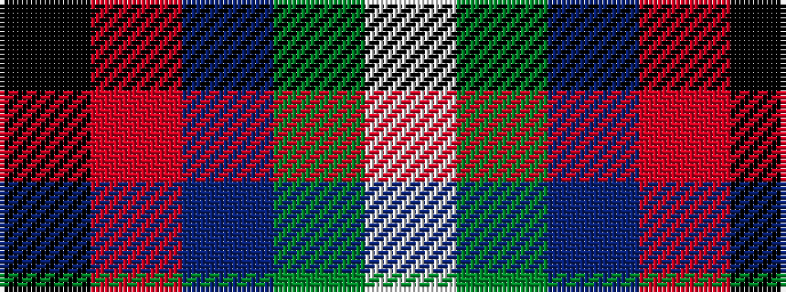

KRBGW

It is a 5 stripe tartan.

<figure class="pat-woven">

<figcaption>idealised sample</figcaption>
</figure>

## Colour Sequence



## Tartans with this colour sequence

| Tartans |
|---------------|
| [Pople](/setts/s5/k10r9n8y8w1/)|
||
| [Pople (Name)](/setts/s5/k1r9n8y8w1~x2/)|
||
