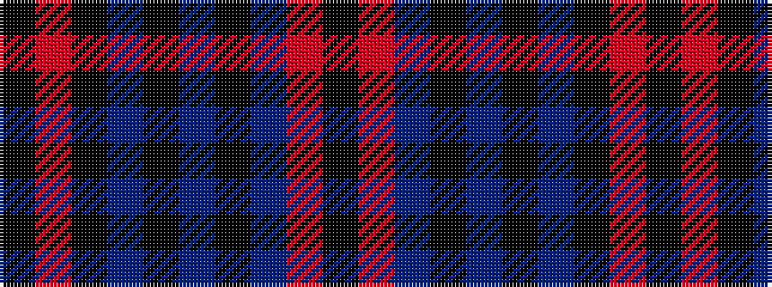

KRBKBKBKRK

It is a 10 stripe tartan.

<figure class="pat-woven">

<figcaption>idealised sample</figcaption>
</figure>

## Colour Sequence



## Tartans with this colour sequence

| Tartans |
|---------------|
| [Douglas (WCWM)](/variants/s10/k2r24n24k2n2k2n3k14r2k2~x2/)|
||
| [Wcwm 1527](/variants/s10/k2r26n26k2n3k2n3k14r2k2~x2/)|
||
