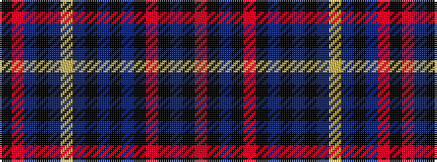

KRBKBYBKBKBKRKBKR

It is a 17 stripe tartan.

<figure class="pat-woven">

<figcaption>idealised sample</figcaption>
</figure>

## Colour Sequence



## Tartans with this colour sequence

| Tartans |
|---------------|
| [North Sea Oil (Fashion)](/setts/s17/k6o1n19k2do1ly1do4k28n2k4n2k1o2k1n2k1o2~x2/)|
||
