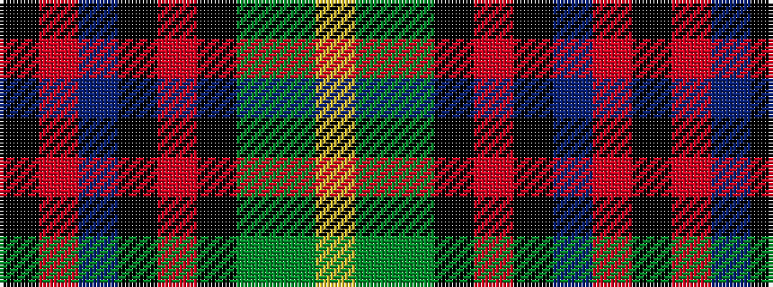

KRBKRKGGY

It is a 9 stripe tartan.

<figure class="pat-woven">

<figcaption>idealised sample</figcaption>
</figure>

## Colour Sequence



## Tartans with this colour sequence

| Tartans |
|---------------|
| [Craigmoor](/variants/s9/k2r8db2k2r2k6dy2dg6ly1~x2/)|
||
| [Craigmoor Tartan](/variants/s9/k2r8db2k2r2k6dy2g6ly1~x2/)|
||
