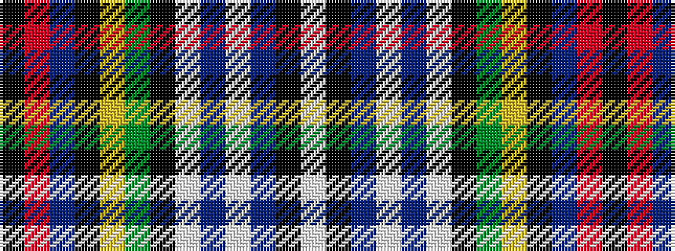

KRBKYGKWBWBKW

It is a 13 stripe tartan.

<figure class="pat-woven">

<figcaption>idealised sample</figcaption>
</figure>

## Colour Sequence



## Tartans with this colour sequence

| Tartans |
|---------------|
| [Badminton Cup](/setts/s13/w3k2b4w4b3w11k2g3ly3k3b12r19k2~x2/)|
||
| [Badminton World Federation](/setts/s13/k3r19b12k3lo3g3k2w11b3w4b4k2w3~x2/)|
||
