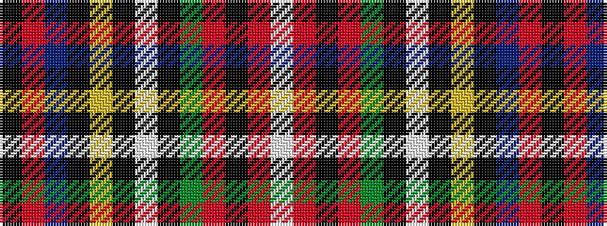

KRBKYKWKGRKRW

It is a 13 stripe tartan.

<figure class="pat-woven">

<figcaption>idealised sample</figcaption>
</figure>

## Colour Sequence



## Tartans with this colour sequence

| Tartans |
|---------------|
| [Harden (Name)](/variants/s13/k2r14t8k9ly1k2w2k2g10r15k4r12w2~x2/)|
||
| [Wilson's, No 1](/variants/s13/k1r14t8k9ly1k2w2k2g10r15k4r12w1~x2/)|
||
