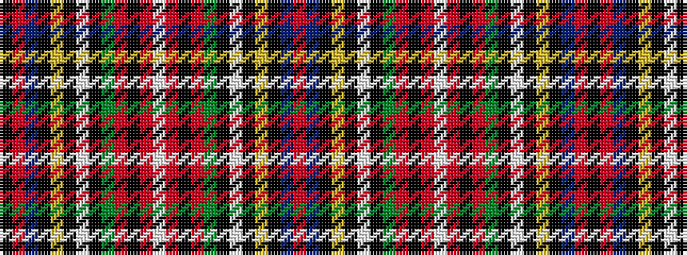

KRBKYKWKGRKRWRKRGKWKYKBR

It is a 24 stripe tartan.

<figure class="pat-woven">

<figcaption>idealised sample</figcaption>
</figure>

## Colour Sequence



## Tartans with this colour sequence

| Tartans |
|---------------|
| [Wilson's No.001](/variants/s24/r14t8k9ly1k2w2k2g10r15k4r12w2r12k4r15g10k2w2k2ly1k9t8r14k2~x2/)|
||
