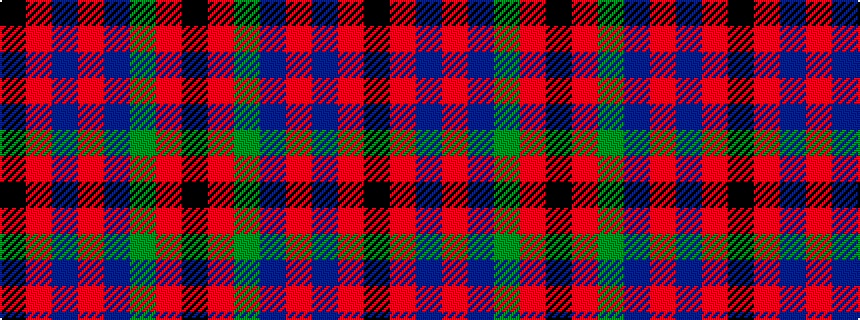

KRBRBGRK

It is a 8 stripe tartan.

<figure class="pat-woven">

<figcaption>idealised sample</figcaption>
</figure>

## Colour Sequence



## Tartans with this colour sequence

| Tartans |
|---------------|
| [Skene, of Cromar](/setts/k4r37db37r2db37g37r37k4/)|
||
