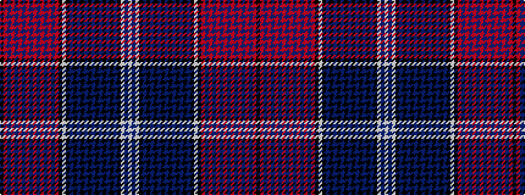

KRBRBRBRBRBRBRBRKWKBKBKBKBKBKBKBKWBW

It is a 36 stripe tartan.

<figure class="pat-woven">

<figcaption>idealised sample</figcaption>
</figure>

## Colour Sequence



## Tartans with this colour sequence

| Tartans |
|---------------|
| [Quebec Centennial](/variants/s36/w50db16w8k8db1k1db1k1db1k1db1k1db1k1db1k1db20k40w12k24r8db1r1db1r1db1r1db1r1db1r1db1r1db28r6k4/)|
||
