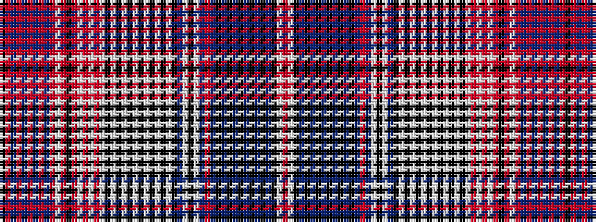

KRBRBRBRBRWRKRWRWRWKWKWKWKWKWKWKBWKWBRBKBKBKBKBKBKWR

It is a 52 stripe tartan.

<figure class="pat-woven">

<figcaption>idealised sample</figcaption>
</figure>

## Colour Sequence



## Tartans with this colour sequence

| Tartans |
|---------------|
| [Mystery Tartan](/setts/s52/r12w1k2t1k1t1k1t1k1t1k1t2k3t3r3t12w1k1w2t7k1w1k1w1k1w1k1w1k1w7k3w16k3w7r5w1r1w2r24k3r3w3r2t1r1t1r1t1r1t1r1k4~x2/)|
||
