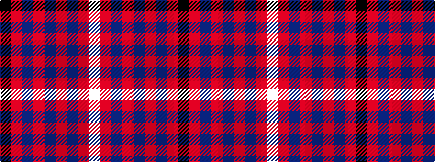

KRBRBRBRW

It is a 9 stripe tartan.

<figure class="pat-woven">

<figcaption>idealised sample</figcaption>
</figure>

## Colour Sequence



## Tartans with this colour sequence

| Tartans |
|---------------|
| [Rose VS](/setts/s9/k4r32db9ri6db2ri3db2ri12lb3/)|
||
| [Rose of Kilravock (Personal)](/setts/s9/k2r35db6r5db2r2db2r14w2~x2/)|
||
