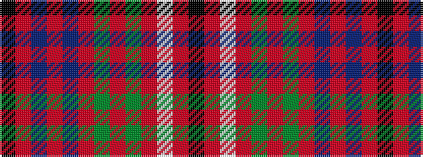

KRBRBRGRGRWRK

It is a 13 stripe tartan.

<figure class="pat-woven">

<figcaption>idealised sample</figcaption>
</figure>

## Colour Sequence



## Tartans with this colour sequence

| Tartans |
|---------------|
| [Cameron of Locheil](/setts/s13/k3r4db2r20db20r2g2r6g10r6w2r3k2~x2/)|
||
| [Cameron of Locheil (Bonner collection)](/setts/s13/k3r4db2r20db20r2dg2r6dg10r6w2r3k2~x2/)|
||
