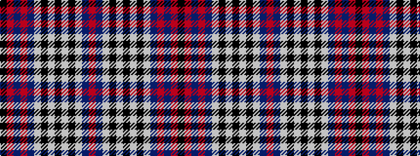

KRBRBWKWKWKWBR

It is a 14 stripe tartan.

<figure class="pat-woven">

<figcaption>idealised sample</figcaption>
</figure>

## Colour Sequence



## Tartans with this colour sequence

| Tartans |
|---------------|
| [Edinburgh Military Tattoo (Dance)](/variants/s14/k4r6db3r16t18w4k4w4k4w4k4w4db18r4~x2/)|
||
| [Edinburgh, Military Tattoo](/variants/s14/k4r5db3r12b18w4k4w4k4w4k4w4db18r4~x2/)|
||
