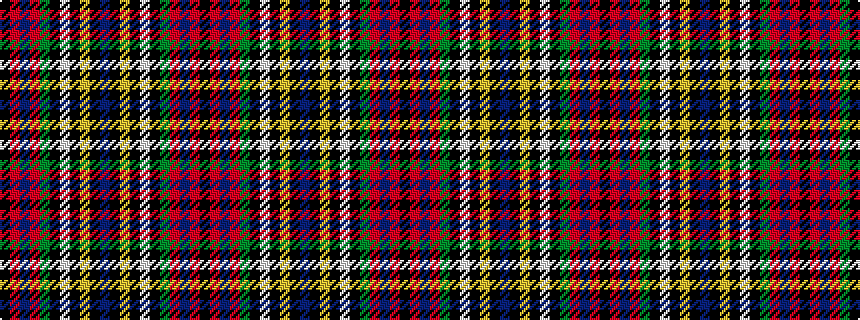

KRBRGKWKYKBKYKWKGRBRK

It is a 21 stripe tartan.

<figure class="pat-woven">

<figcaption>idealised sample</figcaption>
</figure>

## Colour Sequence



## Tartans with this colour sequence

| Tartans |
|---------------|
| [MacLean](/variants/s21/k4r6t4r44g20k4w6k4ly2k8t14k8ly2k4w6k4g20r44t4r6k1~x2/)|
||
