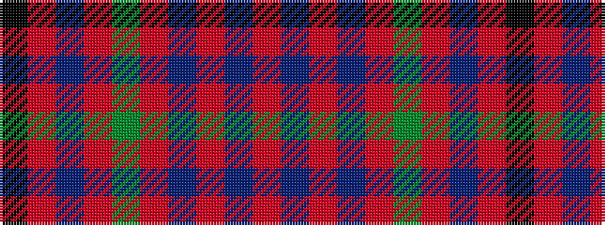

KRBRGRBRBR

It is a 10 stripe tartan.

<figure class="pat-woven">

<figcaption>idealised sample</figcaption>
</figure>

## Colour Sequence



## Tartans with this colour sequence

| Tartans |
|---------------|
| [Moffat (1950)](/setts/s10/r64db16r1db1r12g16r8db2r2k1~x2/)|
||
