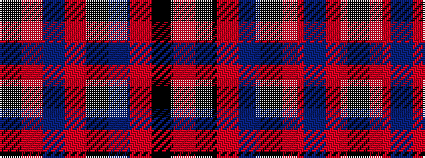

KRBRKBRKR

It is a 9 stripe tartan.

<figure class="pat-woven">

<figcaption>idealised sample</figcaption>
</figure>

## Colour Sequence



## Tartans with this colour sequence

| Tartans |
|---------------|
| [Rosie O'Grady (P&D) (Corporate)](/variants/s9/k35r6db6r6k16db48r36k6r6/)|
||
