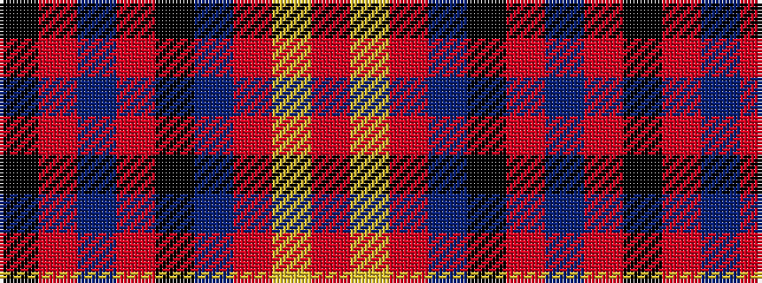

KRBRKBRYR

It is a 9 stripe tartan.

<figure class="pat-woven">

<figcaption>idealised sample</figcaption>
</figure>

## Colour Sequence



## Tartans with this colour sequence

| Tartans |
|---------------|
| [Girl Guiding Scotland (Corporate)](/variants/s9/k36r3db3r3k8db24r18ly3r3~x2/)|
||
