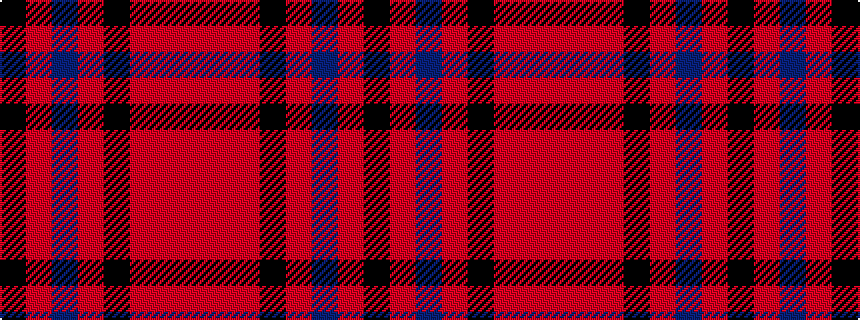

KRBRKRRR

It is a 8 stripe tartan.

<figure class="pat-woven">

<figcaption>idealised sample</figcaption>
</figure>

## Colour Sequence



## Tartans with this colour sequence

| Tartans |
|---------------|
| [Bannockbane Navy Fashion Tartan](/variants/s8/k3m2db30m1k18o30m2o3~x2/)|
||
