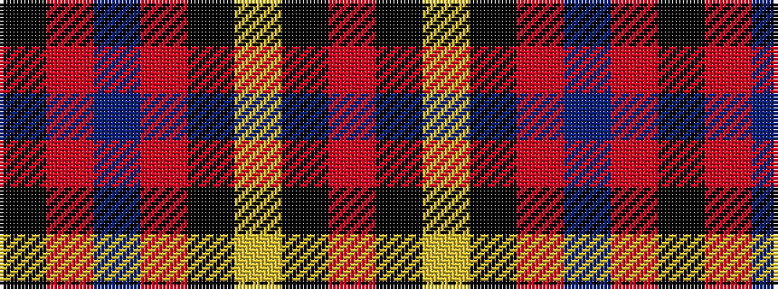

KRBRKYKR

It is a 8 stripe tartan.

<figure class="pat-woven">

<figcaption>idealised sample</figcaption>
</figure>

## Colour Sequence



## Tartans with this colour sequence

| Tartans |
|---------------|
| [Leslie](/variants/s8/r4k6ly1k6r4db16r32k1~x2/)|
||
| [Leslie Red (VS) (Clan)](/variants/s8/r2k3ly1k3r2db8r16k1~x4/)|
||
