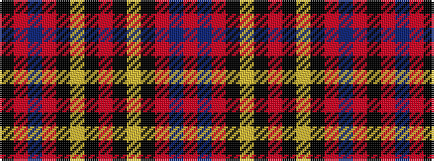

KRBRKYKRKYKRBR

It is a 14 stripe tartan.

<figure class="pat-woven">

<figcaption>idealised sample</figcaption>
</figure>

## Colour Sequence



## Tartans with this colour sequence

| Tartans |
|---------------|
| [Leslie Red (VS)](/variants/s14/r16db8r2k3ly1k3r2k3ly1k3r2db8r16k1~x4/)|
||
