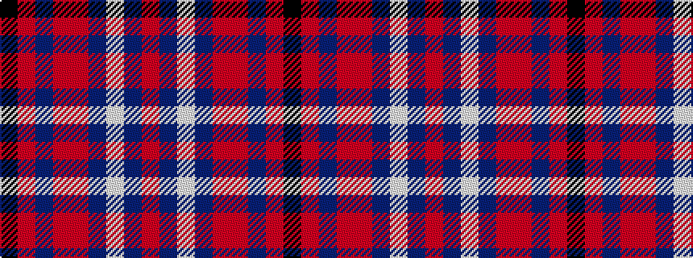

KRBRRBWBR

It is a 9 stripe tartan.

<figure class="pat-woven">

<figcaption>idealised sample</figcaption>
</figure>

## Colour Sequence



## Tartans with this colour sequence

| Tartans |
|---------------|
| [Salt Lake Scots](/setts/s9/oi17t2w2t2oi20o18db3o6k2~x2/)|
||
