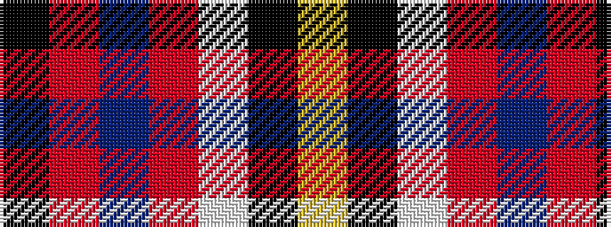

KRBRWKY

It is a 7 stripe tartan.

<figure class="pat-woven">

<figcaption>idealised sample</figcaption>
</figure>

## Colour Sequence



## Tartans with this colour sequence

| Tartans |
|---------------|
| [Hoffman Texas German](/setts/s7/k23r27db3r5w3k14ly6~x2/)|
||
